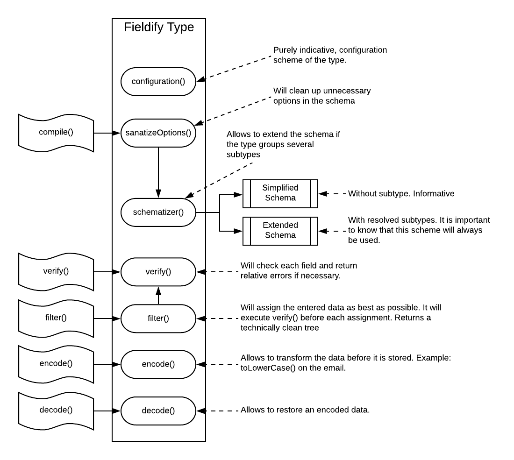

# Fieldify Type Manager

Description du fonctionnement interne de Fieldify sur les différents types en vue de développer de nouveaux type Fieldify. Les types composent les schémas.

## Structure


Fieldify includes an internal object allowing the type in different state. This [file is here](./type.js) and is a simple javascript object that must be inherited by each type during its development. 



### configuration()

This method is purely indicative and simply defines a scheme that the user can apply to configure the type. For example in the String type it is possible to define several limitations such as the minimum or maximum number of characters for the String. This method is not useful internally but is an important information that is given to those who have to interface the type configuration. Interesting to see [String here](./String.js). This function must return the configuration scheme (of type Fieldify) of the type

### schematizer()

La méthode schematizer() est optionnelle et permet de transformer un type nécessitant un seul champs en un type exploitant un sous schéma complet. L'exemple parfait est le [DatePickerRange](./DatePickerRange.js) qui va avoir de deux DatePicker pour permettre la définition du range. If the type adds fields then it feeds the extended schema that will later be used internally. 

### sanatizeOptions(input)

During compilation (before schematization) a check is performed on the options used by the developer for his schema. This method is used to clean up unnecessary options used in the schema. For example [Select](./Select.js) uses this method to filter the options. 

This method is not blocking and does not verify, it only returns the options it accepts for the type. It will therefore return an output of the options acceptable to Fieldify.


### verify(input, cb)

This method allows to check the input data of the type. It is executed asynchronously in order to allow longer checks typically when the type needs an external data that it has to retrieve. 

On one side *input* corresponds to the data (out of schema) that the type has to process and cb() that has to be executed when the processing is finished. The callback cb() takes as argument (error, message). If *error* is equal to TRUE then the data is in error and *message* can be loaded. 

Interesting to look at the [Email](./Email.js) type.

### filter(input, cb)

This method will filter the input data **input**. If the field is not valid then cb(error=TRUE) is executed. At this point the engine will simply remove the data and return at the end only the valid fields by eliminating the invalid ones. Interesting to look at the [Email](./Email.js) type.

### encode(input)

This method will encode the data before its use. Typically an email address must be stored in lower case. So it is possible to add here a transformation pass before storage. Typically a hash could be stored in base64. Interesting to look at the [Email](./Email.js) type.

### decode(input)

This method allows to restore the data encoded with encode(). Typically when restoring a base64. 

## Implementing a type

To implement a new type it is necessary to start by integrating the right inheritance. Below is an example code with all the methods of the ascending object. 

```js
const type = require('./type')

class exampleType extends type {
  encode (input, cb) {
    if (cb) cb(input)
    return (input)
  }

  decode (input, cb) {
    if (cb) cb(input)
    return (input)
  }

  verify (input, cb) {
    if (cb) cb(null)
    return (null)
  }

  filter (input, cb) {
    return (this.verify(input, cb))
  }

  schematizer () {
    return (null)
  }

  configuration () {
    return (null)
  }

  sanatizeOptions (input) {
    return (input)
  }
}

module.exports = {
  code: 'Email',
  description: 'E-mail address',
  class: exampleType
}
```

As defined in [the ascending object](./type.js), all the methods are reimplemented here. Finally the *module.exports* allows to export the references to the type that will be loaded by the engine.